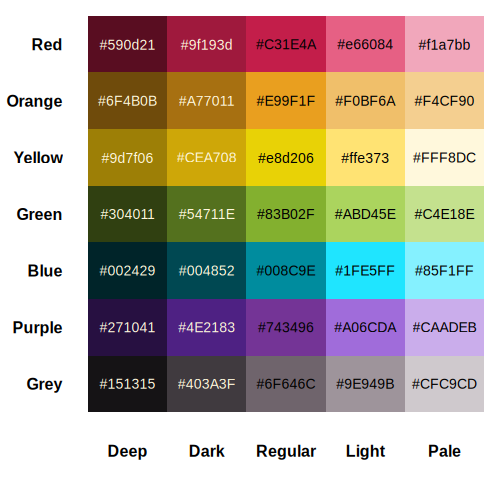

# Display a Color Reference Palette

This function generates a plot displaying a predefined color palette
with color codes for easy reference. The palette includes shades of Red,
Orange, Yellow, Green, Blue, Purple, and Grey.

## Usage

``` r
color.ref()
```

## Value

A plot displaying the color palette.

## Details



## Examples

``` r
color.ref()
```
