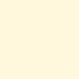

# SnazzieR Color Palette

A collection of named hex colors grouped by hue and tone. Each color is
available as an exported object (e.g., `Red`, `Dark.Red`).

## Usage

``` r
color.list
```

## Format

Each color is a character string representing a hex code.

An object of class `character` of length 1.

An object of class `list` of length 35.

## Details

|              |           |                               |     |              |           |                               |
|--------------|-----------|-------------------------------|-----|--------------|-----------|-------------------------------|
| **Name**     | **Hex**   | **Swatch**                    |     | **Name**     | **Hex**   | **Swatch**                    |
| Deep.Red     | `#590D21` |      |     | Deep.Green   | `#304011` |    |
| Dark.Red     | `#9F193D` |      |     | Dark.Green   | `#54711E` |    |
| Red          | `#C31E4A` |           |     | Green        | `#83B02F` |         |
| Light.Red    | `#E66084` |     |     | Light.Green  | `#ABD45E` |   |
| Pale.Red     | `#F1A7BB` |      |     | Pale.Green   | `#C4E18E` |    |
| Deep.Orange  | `#6F4B0B` |   |     | Deep.Blue    | `#002429` |     |
| Dark.Orange  | `#A77011` |   |     | Dark.Blue    | `#004852` |     |
| Orange       | `#E99F1F` |        |     | Blue         | `#008C9E` |          |
| Light.Orange | `#F0BF6A` |  |     | Light.Blue   | `#1FE5FF` |    |
| Pale.Orange  | `#F4CF90` |   |     | Pale.Blue    | `#85F1FF` |     |
| Deep.Yellow  | `#9D7F06` |   |     | Deep.Purple  | `#271041` |   |
| Dark.Yellow  | `#CEA708` |   |     | Dark.Purple  | `#4E2183` |   |
| Yellow       | `#E8D206` |        |     | Purple       | `#743496` |        |
| Light.Yellow | `#FFE373` |  |     | Light.Purple | `#A06CDA` |  |
| Pale.Yellow  | `#FFF8DC` |   |     | Pale.Purple  | `#CAADEB` |   |
| Deep.Grey    | `#151315` |     |     |              |           |                               |
| Dark.Grey    | `#403A3F` |     |     |              |           |                               |
| Grey         | `#6F646C` |          |     |              |           |                               |
| Light.Grey   | `#9E949B` |    |     |              |           |                               |
| Pale.Grey    | `#CFC9CD` |     |     |              |           |                               |

## See also

[`color.ref`](https://jesusbutforgaypeople.github.io/snazzieR/reference/color.ref.md),
[`snazzieR.theme`](https://jesusbutforgaypeople.github.io/snazzieR/reference/snazzieR.theme.md)
