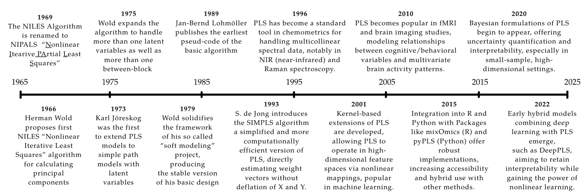

# Overview of Partial Least Squares (PLS) Regression

The `snazzieR` package implements Partial Least Squares regression with support for:

- The **NIPALS** algorithm
- The **SVD-based** method
- Beautiful **console and LaTeX output** formatting

## What is PLS?

PLS regression is a dimension reduction technique that projects predictors to a lower-dimensional space that maximally explains covariance with the response variable(s). It is especially useful when:

- Predictors are highly collinear
- The number of predictors exceeds the number of observations

## Learn More

- [NIPALS Algorithm](pls-nipals.html)
- [SVD Method](pls-svd.html)
- [Output Formatting](pls-formatting.html)

## The Origins of PLS

The story of PLS begins in the snowy mountains of Uppsala, Sweden. In the early 1960s, **Herman Wold** was working on a method to analyze the relationship between a set of predictors and a set of responses. He was particularly interested in the case where the predictors were highly collinear, which made traditional regression methods unreliable. Wold's solution was to use a *latent variable approach*, where he would extract a small number of latent variables from the predictors and use them to predict the responses. This method was later named **Partial Least Squares (PLS)**. The initial algorithm was called **"NILES"** (Nonlinear Iterative Least Squares), which was later renamed to **"NIPALS"** (Nonlinear Iterative Partial Least Squares).

Coming from a background in econometrics, where cleanly independent predictors are rare, Wold was no stranger to the challenges introduced by multicollinearity. In 1966, he laid the groundwork for what would become PLS by introducing an iterative least squares method to estimate principal components [11]. By 1969, he and colleagues applied these methods to econometric problems including canonical correlation analysis and fixed-point estimation [15].

PLS emerged as an extension of PCA. Both reduce dimensionality while preserving structure, but PLS goes further by maximizing the covariance between predictors and responses—making it a more effective regression tool.

   
  <small>Herman Wold; the father of PLS [10]</small>

In 1975, Wold and colleagues released a formal description of the PLS algorithm with applications to increasingly large predictor spaces [13]. This laid the foundation for the so-called **"Basic Design"** of PLS in the late 1970s [14], which provided a more formal treatment of algorithm convergence.

By the 1980s, PLS gained traction in **chemometrics**, particularly for spectroscopy and chromatography. The iterative **NIPALS** algorithm was well-suited to handling large variable sets and missing data [16]. Software packages helped adoption, though theoretical work briefly stalled.

This changed in the 1990s with a resurgence in PLS development, aided by modern computing power. A key moment came with **Sijmen de Jong’s 1993 publication** of an **SVD-based** approach to PLS [3], which computed all components at once instead of iteratively. This dramatically improved efficiency and opened PLS to large-scale applications such as **genomics**, **proteomics**, and **metabolomics** [7].

Modern variants like **sparse PLS** and **kernel PLS** emerged to address high-dimensional or nonlinear problems. And with the rise of **R** and **Python** ecosystems, community-driven implementations made PLS more accessible than ever [8].

  

In the 2000s, PLS found application in **neuroimaging** (e.g., fMRI analysis [5]) and later in **machine learning** and **data mining** through kernel-based extensions [9]. As toolkits matured, it became a staple for classification, regression, and feature extraction.

Recent work integrates PLS with **Bayesian models**, **ensemble methods**, and even **deep learning**. For example, *Deep PLS* methods combine interpretability with powerful representation learning [6]. With this continued expansion, PLS remains one of the most flexible and powerful tools for multivariate statistical analysis.

---

## References

<ol>

<li>Abdi, H. (2010). Partial least squares regression and projection on latent structure regression (PLS regression). <em>Technical report</em>. University of Texas at Dallas. <a href="https://www.utdallas.edu/~herve/Abdi-PLS-pretty.pdf">https://www.utdallas.edu/~herve/Abdi-PLS-pretty.pdf</a></li>

<li>Abdi, H., & Williams, L. J. (2013). Partial least squares methods: Partial least squares correlation and partial least square regression. <em>Methods in Molecular Biology</em>, <em>930</em>, 549–579. <a href="https://doi.org/10.1007/978-1-62703-059-5_23">doi.org/10.1007/978-1-62703-059-5_23</a></li>

<li>de Jong, S. (1993). SIMPLS: An alternative approach to partial least squares regression. <em>Chemometrics and Intelligent Laboratory Systems</em>, <em>18</em>(3), 251–263. <a href="https://doi.org/10.1016/0169-7439(93)85002-X">doi.org/10.1016/0169-7439(93)85002-X</a></li>

<li>Ghosh, S., & Doshi-Velez, F. (2017). Model selection in Bayesian neural networks via horseshoe priors. <em>Journal of Machine Learning Research</em>, <em>20</em>(1), 1–46.</li>

<li>Krishnan, A., Williams, L. J., McIntosh, A. R., & Abdi, H. (2011). Partial least squares (PLS) methods for neuroimaging: A tutorial and review. <em>NeuroImage</em>, <em>56</em>(2), 455–475. <a href="https://doi.org/10.1016/j.neuroimage.2010.07.034">doi.org/10.1016/j.neuroimage.2010.07.034</a></li>

<li>Kong, X., & Ge, Z. (2023). Deep PLS: A lightweight deep learning model for interpretable and efficient data analytics. <em>IEEE Transactions on Neural Networks and Learning Systems</em>, <em>34</em>(11), 8923–8937. <a href="https://doi.org/10.1109/TNNLS.2022.3154090">doi.org/10.1109/TNNLS.2022.3154090</a></li>

<li>Nguyen, D. V., & Rocke, D. M. (2002). Tumor classification by partial least squares using microarray gene expression data. <em>Bioinformatics</em>, <em>18</em>(1), 39–50. <a href="https://doi.org/10.1093/bioinformatics/18.1.39">doi.org/10.1093/bioinformatics/18.1.39</a></li>

<li>Rohart, F., Gautier, B., Singh, A., & Lê Cao, K.-A. (2017). mixOmics: An R package for 'omics feature selection and multiple data integration. <em>PLOS Computational Biology</em>, <em>13</em>(11), e1005752. <a href="https://doi.org/10.1371/journal.pcbi.1005752">doi.org/10.1371/journal.pcbi.1005752</a></li>

<li>Rosipal, R., & Trejo, L. J. (2001). Kernel partial least squares regression in reproducing kernel Hilbert space. <em>Journal of Machine Learning Research</em>, <em>2</em>, 97–123.</li>

<li>Wikipedia contributors. (2025, March 22). Herman Wold. <em>Wikipedia</em>. <a href="https://en.wikipedia.org/wiki/Herman_Wold#/media/File:Professor_Herman_Wold,_Uppsala,_1969.jpg">Wikipedia Link</a></li>

<li>Wold, H. (1966). Estimation of principal components and related models by iterative least squares. In P. R. Krishnajah (Ed.), <em>Multivariate analysis</em> (pp. 391–420). Academic Press.</li>

<li>Wold, H. (1973). Nonlinear iterative partial least squares (NIPALS) modelling: Some current developments. In P. R. Krishnaiah (Ed.), <em>Multivariate Analysis III</em> (pp. 383–407). Academic Press.</li>

<li>Wold, H. (1975). Soft modelling by latent variables: The non-linear iterative partial least squares (NIPALS) approach. In <em>Perspectives in Probability and Statistics</em> (pp. 117–142). Academic Press.</li>

<li>Wold, H. (1979). Model construction and evaluation when theoretical knowledge is scarce: The PLS approach to latent variables. In K. G. Jöreskog & H. Wold (Eds.), <em>Systems under indirect observation: Causality, structure, prediction</em> (Vol. 2, pp. 47–74). North-Holland.</li>

<li>Wold, H., & Lyttkens, E. (1969). Nonlinear iterative partial least squares (NIPALS) estimation procedures. <em>Bulletin of the International Statistical Institute</em>, <em>43</em>, 29–51.</li>

<li>Wold, S., Sjöström, M., & Eriksson, L. (1996). PLS-regression: A basic tool of chemometrics. <em>Chemometrics and Intelligent Laboratory Systems</em>, <em>58</em>(2), 109–130. <a href="https://doi.org/10.1016/S0169-7439(01)00155-1">doi.org/10.1016/S0169-7439(01)00155-1</a></li>

<li>Wright, K. (2017, October 27). The NIPALS algorithm. <em>R-Project.org</em>. <a href="https://cran.r-project.org/web/packages/nipals/vignettes/nipals_algorithm.html">https://cran.r-project.org/web/packages/nipals/vignettes/nipals_algorithm.html</a></li>

</ol>
